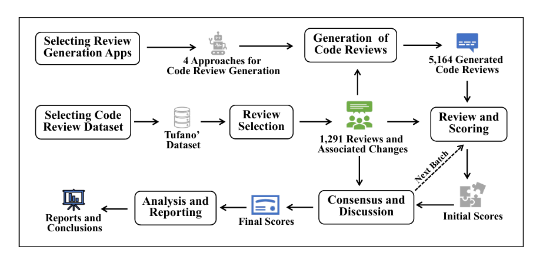

# Replication package of Semantic-based Assessment of Code Reviews: How Far Are We

In this paper, we explore how semantic similarity between generated and reference reviews can enhance the automated assessment of code reviews. We first present a benchmark called GradedReviews, which is constructed by collecting real-world code reviews from open-source projects, generating reviews using state-of-the-art approaches, and manually assessing their quality. We then evaluate existing metrics for code review assessment using this benchmark, revealing their limitations.

# Directory Structure
There are two folders within the replication package:

./Code: The source code of deep assessment of code review generation approach, includes implementation for BLEU, Embedding-based Score, ChatGPT-based Score, ROUGE, METEOR, and DeepSeek-based Score 

./DataSet: Data to replicate the evaluation in the paper

# DataSet:
The methodology used for constructing the benchmark

    

# Code: 
Step-by-step running deep assessment of code review generation approaches:
1. BLEU Score:
   
    python BLEU.py

2. Embedding-based Score:
   
    python embeddingScore.py

3. ChatGPT-based Score:
   
    python LLMScore.py

4. Spearman Rank Correlation Coefficient:

    python spearman.py

5. Kolmogorov-Smirnov Statistic:

    python ks.py

6. METEOR Score:

    python METEOR.py

7. ROUGE-L Score:

    python ROUGE.py

8. DeepSeek-Based Score:

    python ScoreByDeepSeek.py

